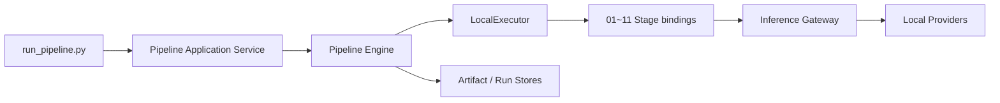

# video-preprocess

긴 영상을 검색·요약·질의응답에 사용할 수 있는 타임라인과 LLM 컨텍스트로 변환하는 로컬
전처리 파이프라인이다. 영상에서 씬, 키프레임, 음성 구간, 전사, 화자와 캡션을 추출한 뒤
SQLite 검색 인덱스와 자기완결형 `context.md`를 생성한다. LLM 호출 자체는 포함하지 않는다.

## 현재 구현 상태

기본 CLI는 다음 실행 경로를 사용한다.



구현된 범위:

- 11단계 DAG 계획과 순차 `LocalExecutor` 실행
- 입력·설정·모델 binding·산출물 checksum 기반 manifest cache
- VAD, STT, diarization, caption, embedding Local Inference Provider
- 전체·단계별·from/to 선택 실행과 같은 local run 재개
- 기존 JSON·Markdown·SQLite 출력 구조와 query CLI

아직 구현되지 않은 범위:

- HTTP Inference Provider와 모델 서버
- REST API·queue adapter와 RemoteExecutor
- run 사이의 global content-addressed cache
- Stage별 cache 사유를 보여주는 완전한 dry-run preview

정확한 완료 상태와 다음 작업은 [docs/STATUS.md](docs/STATUS.md)를 기준으로 한다.

## 요구 환경과 설치

- Python 3.10 이상
- FFmpeg와 ffprobe
- 로컬 모델을 위한 충분한 디스크와 메모리

macOS 기준:

```bash
brew install ffmpeg
python3 -m venv .venv
.venv/bin/pip install -r requirements.txt
.venv/bin/python src/run_pipeline.py --preflight-only
```

`requirements.txt`에는 현재 11단계 로컬 실행에 필요한 패키지와 diarization 의존성이 포함된다.
개발 환경은 pytest를 포함한 다음 파일을 사용한다.

```bash
.venv/bin/pip install -r requirements-dev.txt
.venv/bin/python -m pytest
```

### 화자 분리 credential

07단계는 Hugging Face 게이트 모델을 사용한다.

1. [pyannote/speaker-diarization-community-1](https://huggingface.co/pyannote/speaker-diarization-community-1)
   사용 약관에 동의한다.
2. `HF_TOKEN` 환경변수 또는 Git에서 제외된 프로젝트 루트 `.env`에 토큰을 설정한다.

```dotenv
HF_TOKEN=hf_...
```

토큰이 없거나 optional diarization을 사용할 수 없으면 07단계는 명시적인 `skipped` 결과와
사유를 기록하고, 나머지 단계는 화자 라벨 없이 계속 실행된다. 토큰은 산출물이나 manifest에
기록되지 않는다.

## 빠른 시작

```bash
# 전체 파이프라인 실행
.venv/bin/python src/run_pipeline.py samples/sample.mp4

# 생성된 최종 컨텍스트 확인
sed -n '1,120p' output/sample/11_context/context.md

# 검색 결과로 축약된 질의 컨텍스트 생성
.venv/bin/python src/query.py output/sample "음성 구간 검출은 어디서 설명해?" --topk 2
```

기본 출력 위치는 `output/<video_stem>/`이다. 같은 출력 위치에는 안정적인 local run ID가
사용되므로 중단된 실행을 다시 시작하거나 검증된 산출물을 재사용할 수 있다.

## 실행 범위와 옵션

```bash
# 실행 없이 DAG 순서, boundary input과 force 대상 확인
.venv/bin/python src/run_pipeline.py samples/sample.mp4 --dry-run

# 정확히 한 단계 실행
.venv/bin/python src/run_pipeline.py samples/sample.mp4 --stage 10_index

# 지정 단계부터 영향을 받는 하위 단계 실행
.venv/bin/python src/run_pipeline.py samples/sample.mp4 --from-stage 06_stt

# 지정 단계까지 필요한 상위 단계 실행
.venv/bin/python src/run_pipeline.py samples/sample.mp4 --to-stage 09_timeline

# 한 단계 또는 선택된 plan 전체의 cache 무시
.venv/bin/python src/run_pipeline.py samples/sample.mp4 --force-stage 07_diarize
.venv/bin/python src/run_pipeline.py samples/sample.mp4 --force

# 명시적인 run ID로 실행·재개
.venv/bin/python src/run_pipeline.py samples/sample.mp4 --run-id experiment-01
```

| 옵션 | 의미 |
|---|---|
| `--out DIR` | 출력 상위 디렉터리. 기본값은 `output` |
| `--stage NAME` | 정확히 한 Stage만 선택 |
| `--from-stage NAME` | 선택 Stage와 DAG descendant 실행 |
| `--to-stage NAME` | 선택 Stage와 필요한 ancestor 실행 |
| `--force-stage NAME` | 지정 Stage의 cache 무시. 여러 번 지정 가능 |
| `--force` | 현재 plan의 모든 Stage cache 무시 |
| `--run-id ID` | 같은 manifest를 재개할 논리 run ID |
| `--dry-run` | Stage plan·boundary·force 대상을 JSON으로 출력하고 종료 |
| `--whisper-model MODEL` | faster-whisper 모델. 기본값은 `base` |
| `--language CODE` | STT 언어 고정. 생략하면 자동 감지 |
| `--scene-threshold N` | 씬 변화 임계값. 낮을수록 민감 |
| `--preflight-only` | 모델을 로드하지 않고 실행 환경만 검사 |

`--stage`는 `--from-stage` 또는 `--to-stage`와 함께 사용할 수 없다. 부분 실행은 같은 run의
이전 manifest에 필요한 boundary artifact가 있고 현재 영상 checksum과 일치할 때만 허용된다.
처음 실행하는 output이라면 전체 실행 또는 필요한 상위 단계를 포함한 `--to-stage`부터 수행한다.

현재 `--dry-run`은 cache hit/miss를 추측하지 않고 `evaluated_at_runtime`으로 표시한다. Stage별
cache decision과 stable miss reason 출력은 다음 Phase 3 작업이다.

## 11단계 파이프라인

| 단계 | 처리 | 주요 출력 |
|---|---|---|
| `01_probe` | ffprobe 메타데이터 추출 | `metadata.json` |
| `02_scenes` | PySceneDetect 씬 경계 검출 | `scenes.json`, `scene_stats.csv` |
| `03_keyframes` | 씬별 중앙 키프레임 추출 | `keyframes.json`, `frames/*.jpg`, `keyframe_images.zip` |
| `04_audio` | 오디오 디먹싱·16kHz mono 정규화 | `audio.json`, `audio_16k.wav` |
| `05_vad` | Silero VAD 음성 구간 검출 | `vad_segments.json` |
| `06_stt` | VAD 구간만 faster-whisper 전사 | `transcript.json` |
| `07_diarize` | pyannote 화자 분리 | `diarization.json` |
| `08_captions` | BLIP 키프레임 캡셔닝 | `captions.json` |
| `09_timeline` | 씬·전사·화자·캡션을 공통 시간축으로 병합 | `timeline.json`, `timeline.md` |
| `10_index` | SQLite FTS5 + embedding 검색 인덱스 | `index.db`, `index_summary.json` |
| `11_context` | LLM 입력 컨텍스트 최종본 조립 | `context.md`, `context.json` |

의존 관계와 상세 처리 규칙은 [docs/05-pipeline.md](docs/05-pipeline.md)에 정리되어 있다.

## Cache와 재개

완료 여부는 대표 파일의 존재만으로 판단하지 않는다. Engine은 다음 항목을 cache semantics로
사용하고 Artifact Store가 입력과 출력의 크기·SHA-256을 검증한다.

- Stage 이름과 version
- 입력 artifact의 종류, media type, 크기와 checksum
- 해당 Stage 설정
- 요청한 model binding
- 이전 실행의 effective provider·model·revision·runtime
- 모든 선언된 output의 존재와 integrity

| 상황 | 동작 |
|---|---|
| 같은 local run, 검증된 비모델 Stage | cache hit 가능 |
| effective model fingerprint를 실행 전에 확정할 수 없음 | 안전한 cache miss 후 재실행 |
| 이전 결과가 `skipped` | 조건 재평가를 위해 재실행 |
| 입력·설정·binding·Stage version 변경 | 관련 Stage cache miss |
| output 누락·변조 | cache miss |
| `--force-stage` / `--force` | 지정 범위 강제 실행 |

현재 cache 후보 조회 범위는 같은 `run_id`다. 다른 run의 동일 artifact를 재사용하는 global cache
index는 아직 구현되지 않았다.

## 출력과 Manifest

```text
output/<video_stem>/
├── 00_input/                   # cache integrity 검증용 입력 영상 copy
├── 01_probe/ … 11_context/     # 기존 단계별 산출물
├── _manifests/                 # run/stage manifest, cache key, ArtifactRef
├── _pending/                   # 원자적 publish 전 비공개 임시 artifact
├── logs/run_<run_id>.log       # 상세 실행 로그
└── run_summary.json            # CLI 호환 상태·metrics 요약
```

- 사람이 빠르게 확인할 결과: `09_timeline/timeline.md`
- LLM에 그대로 넣을 최종본: `11_context/context.md`
- 프로그램에서 사용할 최종본: `11_context/context.json`
- 검색 DB: `10_index/index.db`

모델 Stage JSON에는 실제 `provider`, `model`, `revision`, `runtime`이 기록된다. manifest에는
StageTask 입력·설정·binding, StageResult 출력·상태·사유·metrics와 cache key가 기록된다.
`run_summary.json`은 기존 소비자를 위한 view이며 상세 상태의 원본은 `_manifests/`다.

## 검색과 컨텍스트 조립

`query.py`는 SQLite FTS5 키워드 순위와 multilingual embedding cosine 순위를 RRF로 결합한다.
상위 씬 카드와 전체 씬 목차를 조립해 stdout으로 출력하며 LLM을 호출하지 않는다.

```bash
.venv/bin/python src/query.py output/sample "음성 구간 검출 얘기는 어디서 해?" --topk 2
```

검색 순위 근거는 `logs/query_<timestamp>.log`에 DEBUG로 기록된다. 별도 query 프로세스는 현재
embedding 모델을 매번 로드한다. cached Hugging Face 모델이 있어도 metadata HEAD 요청이 발생하는
환경에서는 다음처럼 명시적인 offline 실행을 사용할 수 있다.

```bash
HF_HUB_OFFLINE=1 TRANSFORMERS_OFFLINE=1 \
  .venv/bin/python src/query.py output/sample "음성 구간 검출" --topk 2
```

## 개발과 검증

기본 테스트는 모델 weight를 다운로드하거나 network를 요구하지 않는다.

```bash
.venv/bin/python -m pytest
```

미디어·모델 통합 변경은 `samples/sample.mp4` 전체 실행과 query까지 별도로 검증한다.

```bash
HF_HUB_OFFLINE=1 TRANSFORMERS_OFFLINE=1 \
  .venv/bin/python src/run_pipeline.py samples/sample.mp4 --force
HF_HUB_OFFLINE=1 TRANSFORMERS_OFFLINE=1 \
  .venv/bin/python src/query.py output/sample "음성 구간 검출" --topk 2
```

개발 문서:

- [문서 안내](docs/README.md)
- [현재 상태·검증 기록·다음 작업](docs/STATUS.md)
- [목표 아키텍처](docs/06-target-architecture.md)
- [실행·추론 계약](docs/07-execution-inference-contracts.md)
- [개발 로드맵](docs/08-development-roadmap.md)
- [Architecture Decision Records](docs/adr/)

## 테스트 영상 생성 (macOS)

```bash
cd samples
say -v Yuna -o ph1.aiff "첫 번째 장면입니다. 영상 전처리 파이프라인 테스트를 시작합니다."
say -v Yuna -o ph2.aiff "두 번째 장면에서는 음성 구간 검출이 잘 되는지 확인합니다."
say -v Yuna -o ph3.aiff "마지막 장면입니다. 전사 결과가 씬 타임라인에 병합됩니다."
ffmpeg -v error \
  -f lavfi -i "testsrc=duration=10:size=640x360:rate=25" \
  -f lavfi -i "smptebars=duration=10:size=640x360:rate=25" \
  -f lavfi -i "rgbtestsrc=duration=10:size=640x360:rate=25" \
  -i ph1.aiff -i ph2.aiff -i ph3.aiff \
  -filter_complex "[0:v][1:v][2:v]concat=n=3:v=1:a=0[v];[3:a]aresample=22050,adelay=1500:all=1[a0];[4:a]aresample=22050,adelay=12000:all=1[a1];[5:a]aresample=22050,adelay=22000:all=1[a2];[a0][a1][a2]amix=inputs=3:duration=longest:normalize=0,apad=whole_dur=30[a]" \
  -map "[v]" -map "[a]" -c:v libx264 -preset fast -pix_fmt yuv420p -c:a aac -t 30 -y sample.mp4
```

주의: `say`의 신형 보이스(Flo, Eddy 등)는 `-o` 파일 출력 시 무음이 되는 경우가 있다 — Yuna 사용.

## 아직 없는 것 (다음 단계 후보)

- 오디오 이벤트 태깅 (박수·음악 등)
- 한국어 캡셔닝 VLM 교체 (현재 BLIP은 영어 캡션)
- 긴 영상 대응: 컨텍스트 최종본의 토큰 예산 관리 (씬 수가 많을 때 목차 + 선별
  씬 카드로 축약하는 예산 배분 로직)

아키텍처 마이그레이션과 위 기능의 정확한 구현 순서는
[`docs/08-development-roadmap.md`](docs/08-development-roadmap.md)를 기준으로 하며, 실제
완료 여부는 [`docs/STATUS.md`](docs/STATUS.md)에서 관리한다.
