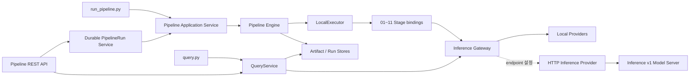

# video-preprocess

긴 영상을 검색·요약·질의응답에 사용할 수 있는 타임라인과 LLM 컨텍스트로 변환하는 로컬
전처리 파이프라인이다. 영상에서 씬, 키프레임, 음성 구간, 전사, 화자와 캡션을 추출한 뒤
SQLite 검색 인덱스와 자기완결형 `context.md`를 생성한다. LLM 호출 자체는 포함하지 않는다.

## 현재 구현 상태

CLI와 REST API는 같은 Application Service와 Engine 실행 경로를 사용한다.



구현된 범위:

- 11단계 DAG 계획과 순차 `LocalExecutor` 실행
- 입력·설정·모델 binding·산출물 checksum 기반 manifest cache
- VAD, STT, diarization, caption, embedding Local Inference Provider
- 전체·단계별·from/to 선택 실행과 같은 local run 재개
- 같은 output workspace의 run 간 content-addressed cache 재사용
- Stage별 cache 상태·실행 예상·stable reason을 제공하는 read-only dry-run
- offline snapshot·immutable revision·VAD asset 기반 local model fingerprint 확인
- Stage timeout, cooperative cancellation과 분류된 bounded retry
- HTTP Inference v1 client, async job submit/poll/cancel, retry와 circuit breaker
- `embedding.default`의 local/HTTP 배포 설정과 원격 effective model cache fingerprint
- LocalEmbeddingProvider를 공개하는 production HTTP server adapter와 실행 CLI
- 영속 run 상태, 멱등성, 취소, artifact와 query를 공개하는 Pipeline REST API v1
- 기존 JSON·Markdown·SQLite 출력 구조와 공통 QueryService 기반 query CLI

아직 구현되지 않은 범위:

- embedding 외 alias의 HTTP 배포 연결
- 직접 media upload, queue adapter와 RemoteExecutor

정확한 완료 상태와 다음 작업은 [docs/STATUS.md](docs/STATUS.md)를 기준으로 한다.

## 요구 환경과 설치

- Python 3.10 이상
- FFmpeg와 ffprobe
- 로컬 모델을 위한 충분한 디스크와 메모리

macOS 기준:

```bash
brew install ffmpeg
python3 -m venv .venv
.venv/bin/pip install -r requirements.txt
.venv/bin/python src/run_pipeline.py --preflight-only
```

`requirements.txt`에는 현재 11단계 로컬 실행에 필요한 패키지와 diarization 의존성이 포함된다.
개발 환경은 pytest를 포함한 다음 파일을 사용한다.

```bash
.venv/bin/pip install -r requirements-dev.txt
.venv/bin/python -m pytest
```

### 화자 분리 credential

07단계는 Hugging Face 게이트 모델을 사용한다.

1. [pyannote/speaker-diarization-community-1](https://huggingface.co/pyannote/speaker-diarization-community-1)
   사용 약관에 동의한다.
2. `HF_TOKEN` 환경변수 또는 Git에서 제외된 프로젝트 루트 `.env`에 토큰을 설정한다.

```dotenv
HF_TOKEN=hf_...
```

토큰이 없거나 optional diarization을 사용할 수 없으면 07단계는 명시적인 `skipped` 결과와
사유를 기록하고, 나머지 단계는 화자 라벨 없이 계속 실행된다. 토큰은 산출물이나 manifest에
기록되지 않는다.

## 빠른 시작

```bash
# 전체 파이프라인 실행
.venv/bin/python src/run_pipeline.py samples/sample.mp4

# 생성된 최종 컨텍스트 확인
sed -n '1,120p' output/sample/11_context/context.md

# 검색 결과로 축약된 질의 컨텍스트 생성
.venv/bin/python src/query.py output/sample "음성 구간 검출은 어디서 설명해?" --topk 2
```

기본 출력 위치는 `output/<video_stem>/`이다. 같은 출력 위치에는 안정적인 local run ID가
사용되므로 중단된 실행을 다시 시작하거나 검증된 산출물을 재사용할 수 있다.

## Pipeline REST API

`serve_pipeline.py`는 허용된 media catalog의 ID를 받아 CLI와 같은
`PipelineApplicationService`/Engine을 실행한다. 외부 요청과 응답에는 로컬 video/output 경로 대신
`media_id`, `run_id`와 `artifact://` 참조만 사용한다.

```bash
export PIPELINE_API_TOKEN=replace-me

.venv/bin/python src/serve_pipeline.py \
  --host 127.0.0.1 \
  --port 8090 \
  --media-root samples \
  --auth-token-env PIPELINE_API_TOKEN
```

다른 terminal에서 run을 생성한다. `Idempotency-Key` header는 body 값과 같아야 한다. 동일 키와
동일 요청을 다시 보내면 새 실행을 만들지 않고 기존 run을 반환한다.

```bash
curl -sS http://127.0.0.1:8090/v1/pipeline-runs \
  -H "Authorization: Bearer $PIPELINE_API_TOKEN" \
  -H 'Content-Type: application/json' \
  -H 'Idempotency-Key: sample-preprocess-v1' \
  -d '{
    "schema_version": "1",
    "idempotency_key": "sample-preprocess-v1",
    "media_id": "sample.mp4",
    "settings": {"language": "ko"}
  }'
```

응답의 `run_id`를 아래 `RUN_ID`에 넣어 상태, artifact와 검색 결과를 조회한다.

```bash
RUN_ID=run_replace_me

curl -sS "http://127.0.0.1:8090/v1/pipeline-runs/$RUN_ID" \
  -H "Authorization: Bearer $PIPELINE_API_TOKEN"

curl -sS "http://127.0.0.1:8090/v1/pipeline-runs/$RUN_ID/artifacts" \
  -H "Authorization: Bearer $PIPELINE_API_TOKEN"

curl -sS "http://127.0.0.1:8090/v1/pipeline-runs/$RUN_ID/queries" \
  -H "Authorization: Bearer $PIPELINE_API_TOKEN" \
  -H 'Content-Type: application/json' \
  -d '{"schema_version":"1","query":"음성 구간 검출","top_k":2}'

curl -sS -X DELETE \
  "http://127.0.0.1:8090/v1/pipeline-runs/$RUN_ID" \
  -H "Authorization: Bearer $PIPELINE_API_TOKEN"
```

| 서버 옵션 | 의미 |
|---|---|
| `--media-root DIR` | `media_id`를 해석할 허용 root. 기본값 `samples` |
| `--workspace-root DIR` | run별 내부 Engine/Artifact workspace. 기본값 `output/api-runs` |
| `--state-root DIR` | 프로세스와 분리된 공개 상태 snapshot. 기본값 `output/api-state` |
| `--max-active-runs N` | 동시에 허용할 local pipeline run 수. 기본값 1 |
| `--max-request-bytes N` | JSON request body 상한. 기본값 1 MiB |
| `--retain-terminal-runs N` | 유지할 최신 terminal API 상태 수. 기본값 1000 |
| `--auth-token-env NAME` | Bearer token 값을 읽을 환경변수 이름 |

현재 v1은 media upload를 제공하지 않으므로 파일을 `--media-root` 아래에 먼저 등록해야 한다.
완료 상태 보존 한도를 넘으면 오래된 API 상태와 멱등성 record만 제거하며 Engine manifest,
workspace와 artifact는 자동 삭제하지 않는다. 서버 재시작 시 완료 상태는 계속 조회할 수 있고 당시
실행 중이던 local run은 조용히 재실행하지 않고 `RUN_INTERRUPTED` 실패로 조정한다. loopback 밖에
bind할 때는 Bearer 인증과 reverse proxy/service mesh의 TLS 종료를 사용한다.

## 실행 범위와 옵션

```bash
# 실행 없이 DAG 순서, boundary input과 force 대상 확인
.venv/bin/python src/run_pipeline.py samples/sample.mp4 --dry-run

# 정확히 한 단계 실행
.venv/bin/python src/run_pipeline.py samples/sample.mp4 --stage 10_index

# 지정 단계부터 영향을 받는 하위 단계 실행
.venv/bin/python src/run_pipeline.py samples/sample.mp4 --from-stage 06_stt

# 지정 단계까지 필요한 상위 단계 실행
.venv/bin/python src/run_pipeline.py samples/sample.mp4 --to-stage 09_timeline

# 한 단계 또는 선택된 plan 전체의 cache 무시
.venv/bin/python src/run_pipeline.py samples/sample.mp4 --force-stage 07_diarize
.venv/bin/python src/run_pipeline.py samples/sample.mp4 --force

# 명시적인 run ID로 실행·재개
.venv/bin/python src/run_pipeline.py samples/sample.mp4 --run-id experiment-01
```

| 옵션 | 의미 |
|---|---|
| `--out DIR` | 출력 상위 디렉터리. 기본값은 `output` |
| `--stage NAME` | 정확히 한 Stage만 선택 |
| `--from-stage NAME` | 선택 Stage와 DAG descendant 실행 |
| `--to-stage NAME` | 선택 Stage와 필요한 ancestor 실행 |
| `--force-stage NAME` | 지정 Stage의 cache 무시. 여러 번 지정 가능 |
| `--force` | 현재 plan의 모든 Stage cache 무시 |
| `--run-id ID` | 같은 manifest를 재개할 논리 run ID |
| `--dry-run` | Stage별 cache 상태·실행 예상·reason을 JSON으로 출력하고 종료 |
| `--stage-timeout-sec N` | 각 Stage timeout. 기본값은 제한 없음 |
| `--max-stage-attempts N` | 일시적 실패의 Stage별 최대 시도 수. 기본값은 1 |
| `--retry-backoff-sec N` | 첫 재시도 전 대기 시간. 기본값은 0초 |
| `--embedding-endpoint URL` | `embedding.default`를 HTTP Inference v1 endpoint에 연결 |
| `--embedding-token-env NAME` | bearer token 값을 읽을 환경변수 이름 |
| `--embedding-artifact-namespace NAME` | endpoint가 읽을 수 있는 Artifact namespace. 반복 가능 |
| `--whisper-model MODEL` | faster-whisper 모델. 기본값은 `base` |
| `--language CODE` | STT 언어 고정. 생략하면 자동 감지 |
| `--scene-threshold N` | 씬 변화 임계값. 낮을수록 민감 |
| `--preflight-only` | 모델을 로드하지 않고 실행 환경만 검사 |

`--stage`는 `--from-stage` 또는 `--to-stage`와 함께 사용할 수 없다. 부분 실행은 같은 run의
이전 manifest에 필요한 boundary artifact가 있고 현재 영상 checksum과 일치할 때만 허용된다.
처음 실행하는 output이라면 전체 실행 또는 필요한 상위 단계를 포함한 `--to-stage`부터 수행한다.

`--dry-run`은 output·manifest를 만들지 않는 read-only 경로다. 각 Stage를 `hit`, `miss`,
`forced`, `blocked`로 표시하고 `will_execute`와 stable reason code를 출력한다. 상위 Stage가
실행되어야 새 output checksum을 알 수 있으면 stale downstream manifest를 추정하지 않고
`REQUIRED_INPUT_UNAVAILABLE`로 차단한다. 로드된 모델, immutable revision, offline local snapshot과
VAD asset은 실행 전에 fingerprint를 확인한다. 온라인의 변경 가능한 `main/default`처럼 현재
revision을 확정할 수 없는 Stage는 안전하게 `EFFECTIVE_MODELS_UNAVAILABLE` miss로 표시한다.

### 원격 embedding

endpoint를 지정하지 않으면 기존 LocalEmbeddingProvider를 사용한다. 원격 실행은 서버가 HTTP
Inference v1과 `embedding.default` capability를 제공할 때 다음처럼 선택한다. token 값은 CLI 인수에
넣지 않고 환경변수로 전달하며 dry-run, manifest와 로그에 기록되지 않는다.

```bash
export MODEL_SERVER_TOKEN=replace-me

# 첫 terminal: 실제 local embedding backend를 HTTP Inference v1으로 제공
.venv/bin/python src/serve_inference.py \
  --host 127.0.0.1 \
  --port 8080 \
  --auth-token-env MODEL_SERVER_TOKEN \
  --warmup

# 두 번째 terminal: 같은 Stage를 remote embedding 설정으로 실행
.venv/bin/python src/run_pipeline.py samples/sample.mp4 \
  --embedding-endpoint http://127.0.0.1:8080 \
  --embedding-token-env MODEL_SERVER_TOKEN

.venv/bin/python src/query.py output/sample "음성 구간 검출" \
  --embedding-endpoint http://127.0.0.1:8080 \
  --embedding-token-env MODEL_SERVER_TOKEN
```

원격 Provider 실패 시 local 모델로 자동 fallback하지 않는다. 성공 응답의 실제 provider, model,
resolved revision과 runtime은 기존 index metadata와 Engine cache 판정에 사용된다.

server는 기본적으로 loopback에 bind하고 process-local bounded job registry를 사용한다. 재시작 시 job과
idempotency record는 복구되지 않는다. 외부 interface에 bind할 때는 bearer credential을 필수로
설정하고 reverse proxy나 service mesh에서 TLS를 종료해야 한다.

timeout은 attempt의 cooperative cancellation을 요청하고 Stage가 안전한 반환 경계에 도달한 뒤
`STAGE_TIMEOUT`으로 기록한다. 따라서 token을 확인하지 않는 기존 sync/native 호출은 설정한 시간에
즉시 강제 종료되지 않는다. 기본 retry 대상은 timeout과 Executor submit/result 전송 실패뿐이며,
영구 입력 오류나 cancellation은 재시도하지 않는다. retry마다 attempt가 증가해 manifest와
`run_summary.json`에 별도로 남는다.

## 11단계 파이프라인

| 단계 | 처리 | 주요 출력 |
|---|---|---|
| `01_probe` | ffprobe 메타데이터 추출 | `metadata.json` |
| `02_scenes` | PySceneDetect 씬 경계 검출 | `scenes.json`, `scene_stats.csv` |
| `03_keyframes` | 씬별 중앙 키프레임 추출 | `keyframes.json`, `frames/*.jpg`, `keyframe_images.zip` |
| `04_audio` | 오디오 디먹싱·16kHz mono 정규화 | `audio.json`, `audio_16k.wav` |
| `05_vad` | Silero VAD 음성 구간 검출 | `vad_segments.json` |
| `06_stt` | VAD 구간만 faster-whisper 전사 | `transcript.json` |
| `07_diarize` | pyannote 화자 분리 | `diarization.json` |
| `08_captions` | BLIP 키프레임 캡셔닝 | `captions.json` |
| `09_timeline` | 씬·전사·화자·캡션을 공통 시간축으로 병합 | `timeline.json`, `timeline.md` |
| `10_index` | SQLite FTS5 + embedding 검색 인덱스 | `index.db`, `index_summary.json` |
| `11_context` | LLM 입력 컨텍스트 최종본 조립 | `context.md`, `context.json` |

의존 관계와 상세 처리 규칙은 [docs/05-pipeline.md](docs/05-pipeline.md)에 정리되어 있다.

## Cache와 재개

완료 여부는 대표 파일의 존재만으로 판단하지 않는다. Engine은 다음 항목을 cache semantics로
사용하고 Artifact Store가 입력과 출력의 크기·SHA-256을 검증한다.

- Stage 이름과 version
- 입력 artifact의 종류, media type, 크기와 checksum
- 해당 Stage 설정
- 요청한 model binding
- 이전 실행의 effective provider·model·revision·runtime
- 모든 선언된 output의 존재와 integrity

| 상황 | 동작 |
|---|---|
| 같은 Store의 같은/다른 run, 검증된 Stage | cache hit 가능 |
| effective model fingerprint를 실행 전에 확정할 수 없음 | 안전한 cache miss 후 재실행 |
| 이전 결과가 `skipped` | 조건 재평가를 위해 재실행 |
| 입력·설정·binding·Stage version 변경 | 관련 Stage cache miss |
| output 누락·변조 | cache miss |
| `--force-stage` / `--force` | 지정 범위 강제 실행 |

Local Run Store는 content cache key별 manifest 후보를 인덱싱한다. 따라서 같은 output workspace의
다른 `run_id`도 task semantics, effective model fingerprint와 모든 artifact checksum이 일치하면
재사용한다. 다른 output namespace나 외부 Store 사이의 공유는 해당 Store 구현이 별도 index 정책을
제공해야 한다.

## 출력과 Manifest

```text
output/<video_stem>/
├── 00_input/                   # cache integrity 검증용 입력 영상 copy
├── 01_probe/ … 11_context/     # 기존 단계별 산출물
├── _manifests/                 # run/stage manifest, cache key, ArtifactRef
├── _pending/                   # 원자적 publish 전 비공개 임시 artifact
├── logs/run_<run_id>.log       # 상세 실행 로그
└── run_summary.json            # CLI 호환 상태·metrics 요약
```

- 사람이 빠르게 확인할 결과: `09_timeline/timeline.md`
- LLM에 그대로 넣을 최종본: `11_context/context.md`
- 프로그램에서 사용할 최종본: `11_context/context.json`
- 검색 DB: `10_index/index.db`

모델 Stage JSON에는 실제 `provider`, `model`, `revision`, `runtime`이 기록된다. manifest에는
StageTask 입력·설정·binding, StageResult 출력·상태·사유·metrics와 cache key가 기록된다.
`run_summary.json`은 기존 소비자를 위한 view이며 상세 상태의 원본은 `_manifests/`다.

## 검색과 컨텍스트 조립

`query.py`는 NFKC 정규화 단어·문자 2~3-gram FTS5 순위와 multilingual embedding cosine 순위를
RRF로 결합한다. keyword가 없는 semantic 결과는 기본 cosine 0.35 이상만 사용하고, 통과한 결과가
없으면 `no_answer`로 판정한다. 상위 씬 카드와 전체 씬 목차를 조립하며 LLM을 호출하지 않는다.

```bash
.venv/bin/python src/query.py output/sample "음성 구간 검출 얘기는 어디서 해?" --topk 2
.venv/bin/python src/query.py output/sample "음성 구간 검출" --json
```

`--min-similarity`로 의미 검색 하한을 -1~1 범위에서 조정할 수 있다. `--json`은 최종 RRF 점수,
keyword/semantic 순위·점수, 선택 근거와 `no_answer`를 출력한다. 검색 순위 근거는
`logs/query_<timestamp>.log`에도 DEBUG로 기록된다. 별도 query 프로세스는 현재
embedding 모델을 매번 로드한다. cached Hugging Face 모델이 있어도 metadata HEAD 요청이 발생하는
환경에서는 다음처럼 명시적인 offline 실행을 사용할 수 있다.

```bash
HF_HUB_OFFLINE=1 TRANSFORMERS_OFFLINE=1 \
  .venv/bin/python src/query.py output/sample "음성 구간 검출" --topk 2
```

## 개발과 검증

기본 테스트는 모델 weight를 다운로드하거나 network를 요구하지 않는다.

```bash
.venv/bin/python -m pytest
```

loopback port를 여는 HTTP contract와 production client integration test는 기본 경로에서 제외하고
명시적으로 실행한다.

```bash
.venv/bin/python -m pytest -o addopts='' \
  tests/contracts/test_fake_inference_server.py \
  tests/inference/test_http_provider_integration.py \
  tests/inference/test_embedding_deployment_integration.py \
  tests/inference/test_http_server_integration.py

.venv/bin/python -m pytest -m integration \
  tests/api/test_pipeline_http_server_integration.py
```

cached 실제 SentenceTransformer까지 포함한 server E2E는 명시적으로 실행한다.

```bash
HF_HUB_OFFLINE=1 TRANSFORMERS_OFFLINE=1 \
  .venv/bin/python -m pytest -o addopts='' \
  tests/inference/test_http_server_model.py

# 실제 sample의 11단계 REST run + artifact + query E2E
HF_HUB_OFFLINE=1 TRANSFORMERS_OFFLINE=1 \
  .venv/bin/python -m pytest -m 'integration and model' \
  tests/api/test_pipeline_api_model.py
```

미디어·모델 통합 변경은 `samples/sample.mp4` 전체 실행과 query까지 별도로 검증한다.

```bash
HF_HUB_OFFLINE=1 TRANSFORMERS_OFFLINE=1 \
  .venv/bin/python src/run_pipeline.py samples/sample.mp4 --force
HF_HUB_OFFLINE=1 TRANSFORMERS_OFFLINE=1 \
  .venv/bin/python src/query.py output/sample "음성 구간 검출" --topk 2
```

개발 문서:

- [문서 안내](docs/README.md)
- [현재 상태·검증 기록·다음 작업](docs/STATUS.md)
- [목표 아키텍처](docs/06-target-architecture.md)
- [실행·추론 계약](docs/07-execution-inference-contracts.md)
- [HTTP Inference OpenAPI v1](docs/openapi/inference-v1.yaml)
- [Pipeline REST OpenAPI v1](docs/openapi/pipeline-v1.yaml)
- [개발 로드맵](docs/08-development-roadmap.md)
- [Architecture Decision Records](docs/adr/)

## 테스트 영상 생성 (macOS)

```bash
cd samples
say -v Yuna -o ph1.aiff "첫 번째 장면입니다. 영상 전처리 파이프라인 테스트를 시작합니다."
say -v Yuna -o ph2.aiff "두 번째 장면에서는 음성 구간 검출이 잘 되는지 확인합니다."
say -v Yuna -o ph3.aiff "마지막 장면입니다. 전사 결과가 씬 타임라인에 병합됩니다."
ffmpeg -v error \
  -f lavfi -i "testsrc=duration=10:size=640x360:rate=25" \
  -f lavfi -i "smptebars=duration=10:size=640x360:rate=25" \
  -f lavfi -i "rgbtestsrc=duration=10:size=640x360:rate=25" \
  -i ph1.aiff -i ph2.aiff -i ph3.aiff \
  -filter_complex "[0:v][1:v][2:v]concat=n=3:v=1:a=0[v];[3:a]aresample=22050,adelay=1500:all=1[a0];[4:a]aresample=22050,adelay=12000:all=1[a1];[5:a]aresample=22050,adelay=22000:all=1[a2];[a0][a1][a2]amix=inputs=3:duration=longest:normalize=0,apad=whole_dur=30[a]" \
  -map "[v]" -map "[a]" -c:v libx264 -preset fast -pix_fmt yuv420p -c:a aac -t 30 -y sample.mp4
```

주의: `say`의 신형 보이스(Flo, Eddy 등)는 `-o` 파일 출력 시 무음이 되는 경우가 있다 — Yuna 사용.

## 아직 없는 것 (다음 단계 후보)

- 오디오 이벤트 태깅 (박수·음악 등)
- 한국어 캡셔닝 VLM 교체 (현재 BLIP은 영어 캡션)
- 긴 영상 대응: 컨텍스트 최종본의 토큰 예산 관리 (씬 수가 많을 때 목차 + 선별
  씬 카드로 축약하는 예산 배분 로직)

아키텍처 마이그레이션과 위 기능의 정확한 구현 순서는
[`docs/08-development-roadmap.md`](docs/08-development-roadmap.md)를 기준으로 하며, 실제
완료 여부는 [`docs/STATUS.md`](docs/STATUS.md)에서 관리한다.
