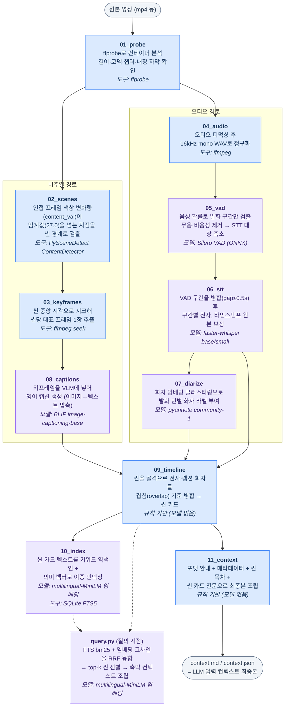

# 파이프라인 단계별 처리 로직·사용 모델

구현된 11단계 파이프라인의 처리 흐름. **파란 계열 = 규칙 기반(모델 없음)**,
**보라 계열 = ML 모델 사용** 단계이다.

## 단계별 상세

| 단계 | 처리 로직 | 모델 / 도구 | 실측 (57초 쇼츠) |
|---|---|---|---|
| 01_probe | 컨테이너 메타데이터 추출. 챕터·내장 자막 유무를 감지해 후속 단계 최적화 근거 제공 | ffprobe | 0.02s |
| 02_scenes | 인접 프레임 간 HSV 색상 변화량이 임계값(27.0)을 넘으면 씬 경계로 판정. 프레임별 통계를 CSV로 저장해 임계값 튜닝 지원 | PySceneDetect `ContentDetector` | 0.9s |
| 03_keyframes | 씬 중앙 타임스탬프로 입력 시크 후 1프레임만 디코딩 (전체 디코딩 회피) | ffmpeg `-ss` | 0.3s |
| 04_audio | 오디오 트랙 분리 후 모든 음성 모델의 공통 입력인 16kHz mono PCM으로 정규화 | ffmpeg | 0.1s |
| 05_vad | 프레임 단위 음성 확률 계산 → 발화 구간만 추출. 무음 구간을 STT에서 제외해 시간 절약 + Whisper 무음 환각 방지 | Silero VAD (ONNX, faster-whisper 내장) | 0.1s |
| 06_stt | 인접 VAD 구간 병합(gap ≤ 0.5s) 후 구간별 전사. 구간 오프셋을 더해 원본 시간축으로 보정 | faster-whisper `base`(기본)/`small` (CTranslate2 int8) | 5.6s / 13.9s |
| 07_diarize | 음성 구간을 화자 임베딩으로 변환 후 클러스터링 → 발화 턴별 화자 라벨 | pyannote `speaker-diarization-community-1` (HF 게이트) | 27.9s |
| 08_captions | 키프레임을 VLM에 입력해 캡션 생성. 이미지(수백~수천 토큰)를 텍스트(수십 토큰)로 압축 | BLIP `image-captioning-base` | 3.0s |
| 09_timeline | 씬을 골격으로 병합. 전사→씬은 겹침 ≥ 50% 기준 귀속, 전사→화자는 최대 겹침 턴의 라벨 채택 | 규칙 기반 | 0.0s |
| 10_index | 씬 카드 텍스트(캡션+전사)를 ① FTS5 역색인 ② 정규화 384차원 벡터로 이중 저장 | sentence-transformers `paraphrase-multilingual-MiniLM-L12-v2`, SQLite FTS5 | 0.2s |
| 11_context | 포맷 규칙 전문 + 메타데이터 + 씬 목차 + 씬 카드 전문을 하나의 자기완결 문서로 조립 | 규칙 기반 | 0.0s |
| query.py | 키워드(bm25)·의미(코사인) 순위를 RRF(k=60)로 융합 → top-k 씬 + 앞뒤 문맥으로 축약 컨텍스트 조립 | MiniLM 임베딩 (질의 인코딩) | ~10s (모델 로드 포함) |

## 설계 대응 관계

- **조기 압축**: 05_vad (무음 제거), 02_scenes (씬 단위 처리)
- **텍스트화 우선**: 06_stt (음성→텍스트), 08_captions (이미지→텍스트)
- **질의 시점 선별**: 10_index + query.py (전처리는 전부, 입력은 top-k만)
- **우아한 성능 저하**: 07_diarize는 토큰/오디오가 없으면 사유를 기록하고 스킵,
  나머지 파이프라인은 화자 라벨 없이 계속 동작
