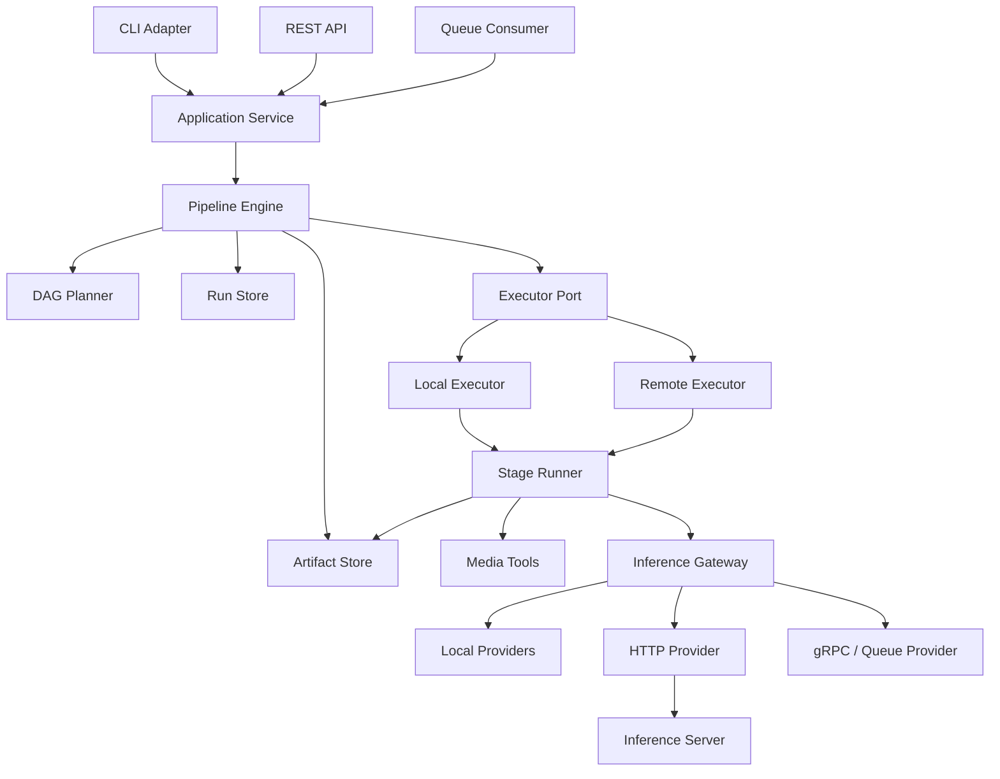
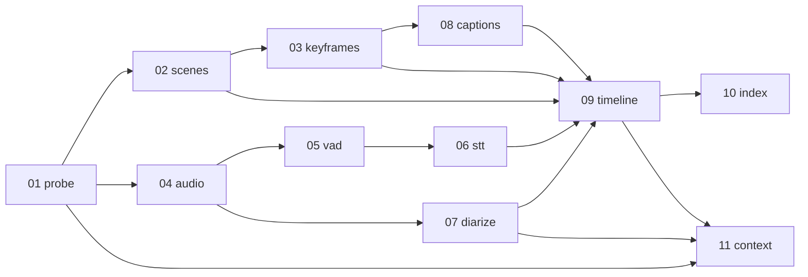

# 목표 아키텍처: 엔진·실행기·추론 공급자 분리

상태: **목표 설계(Target)**  
결정 근거: [`ADR-0001`](./adr/0001-separate-engine-executor-and-inference-providers.md)  
현재 구현 상태: [`STATUS.md`](./STATUS.md)

## 1. 목적

현재 MVP는 하나의 Python 프로세스가 파이프라인 순서, 로컬 파일 경로, 모델 로드와
추론을 모두 담당한다. 샘플 검증에는 단순하고 유효하지만 다음 확장에는 제약이 있다.

- 다른 서비스가 전처리 실행과 결과 조회를 요청해야 한다.
- Whisper, diarization, VLM, embedding을 각각 로컬 또는 서버에서 실행해야 한다.
- 일부 단계만 원격 워커로 보내거나 하드웨어 특성에 맞게 배치해야 한다.
- 실패한 실행을 재개하고, 설정·모델 변경에 따라 정확하게 캐시를 무효화해야 한다.
- 파일 시스템 외의 공유 스토리지로 확장해야 한다.

목표는 파이프라인 알고리즘과 배포 방식을 분리해, 현재 로컬 CLI 사용성을 유지하면서도
API·작업 큐·원격 모델 서버에 연결 가능한 구조로 전환하는 것이다.

## 2. 핵심 용어와 책임

| 구성 요소 | 책임 | 책임이 아닌 것 |
|---|---|---|
| Application Service | 실행·조회 유스케이스 제공, 요청 검증 | 단계 스케줄링, 모델 구현 |
| Pipeline Engine | DAG 계획, 상태 전이, 캐시 판단, 실행 정책 | 모델 로드, HTTP 전송, FFmpeg 실행 |
| Executor | 단계를 어느 실행 환경에서 수행할지 결정 | 모델 라우팅, 파이프라인 의존성 결정 |
| Stage | 한 단계의 도메인 변환 수행 | 로컬/원격 배포 판단, 전역 경로 조합 |
| Inference Gateway | 모델 alias를 provider로 라우팅 | 단계 순서 결정 |
| Inference Provider | 특정 로컬 모델 또는 서버 엔드포인트 호출 | 파이프라인 캐시·상태 관리 |
| Artifact Store | 대용량 입력·출력 저장과 참조 제공 | 실행 순서·재시도 결정 |
| Run Store | 실행·단계 상태와 manifest 보존 | 미디어 본문 저장 |
| Event Sink | 로그, 진행률, 메트릭, trace 이벤트 수집 | 상태의 유일한 원본 역할 |

중요한 구분은 다음과 같다.

- **Executor는 단계의 실행 위치를 결정한다.**
- **Inference Provider는 모델 추론의 실행 위치를 결정한다.**

따라서 `LocalExecutor + HttpInferenceProvider`와
`RemoteExecutor + LocalInferenceProvider` 조합이 모두 가능해야 한다.

## 3. 목표 구성도



## 4. 제어 흐름

1. CLI, API 또는 큐 소비자가 Application Service에 실행을 요청한다.
2. Application Service는 입력 영상을 Artifact Store에 등록하고 `run_id`를 발급한다.
3. Engine은 파이프라인 정의와 설정으로 DAG 및 `StageTask`를 만든다.
4. Engine은 상위 산출물, 설정, 모델 binding과 stage version으로 캐시를 판정한다.
5. 실행이 필요한 작업을 Executor에 제출한다.
6. Executor는 Stage Runner를 호출하고 필요한 서비스를 주입한다.
7. Stage는 입력 `ArtifactRef`를 읽고, 필요하면 Inference Gateway에 요청한다.
8. Stage는 산출물을 Artifact Store에 저장하고 `StageResult`를 반환한다.
9. Engine은 Run Store의 상태와 manifest를 원자적으로 갱신한다.
10. 모든 필수 단계가 성공하면 실행을 완료하고 결과 artifact를 공개한다.

## 5. 권장 패키지 구조

마이그레이션 완료 후의 목표이며, 한 번에 전체 디렉터리를 이동하지 않는다.

```text
src/video_preprocess/
├── domain/
│   ├── artifacts.py          # ArtifactRef, ArtifactMetadata
│   ├── stages.py             # StageSpec, StageTask, StageResult
│   ├── inference.py          # 모델 요청·응답 공통 타입
│   └── errors.py             # 오류 분류
├── engine/
│   ├── pipeline.py           # 실행 상태 머신
│   ├── planner.py            # DAG 계획
│   ├── registry.py           # 단계 등록
│   ├── cache.py              # manifest·무효화
│   └── policies.py           # retry·skip·fallback 정책
├── stages/
│   ├── probe.py
│   ├── scenes.py
│   └── ...
├── inference/
│   ├── gateway.py
│   ├── local/
│   │   ├── whisper.py
│   │   ├── diarization.py
│   │   ├── caption.py
│   │   └── embedding.py
│   └── http/
│       └── provider.py
├── executors/
│   ├── base.py
│   ├── local.py
│   └── remote.py
├── storage/
│   ├── artifacts.py
│   ├── local_artifacts.py
│   ├── runs.py
│   └── local_runs.py
├── media/
│   ├── ffmpeg.py
│   └── scenedetect.py
├── services/
│   ├── pipeline.py
│   └── query.py
└── adapters/
    ├── cli.py
    ├── api.py
    └── queue.py
```

## 6. 의존 방향 규칙

의존은 바깥 구현에서 안쪽 계약으로만 향한다.

```text
adapters → services → engine → domain
executors ────────────────→ domain
stages ──────────────────→ domain ports
inference implementations → inference contracts
storage implementations ─→ storage contracts
```

필수 규칙:

1. `domain`은 FFmpeg, ML 라이브러리, HTTP 클라이언트를 import하지 않는다.
2. `engine`은 `transformers`, `faster_whisper`, `pyannote`를 import하지 않는다.
3. Stage는 `output/<name>` 같은 전역 경로를 직접 조합하지 않는다.
4. Stage는 구체적인 provider 클래스를 생성하지 않는다.
5. Executor는 모델별 라우팅 정책을 갖지 않는다.
6. Provider는 파이프라인 단계 순서나 캐시 정책을 알지 못한다.
7. CLI와 API는 동일한 Application Service를 사용한다.

## 7. 파이프라인 DAG

초기 DAG는 현재 실행 순서를 보존하되 독립 분기를 명시한다.



초기 `LocalExecutor`는 순차 실행으로 동등성을 확보한다. 이후 비주얼 경로와 오디오
경로를 병렬화하되, 병렬 정책은 Stage가 아니라 Executor가 소유한다.

현재 `StageRegistry`와 `DAGPlanner`가 이 11개 Stage의 logical input/output과 dependency를
검증하고 stable name 사전순 tie-break로 deterministic topological plan을 만든다. exact,
from, to 선택과 plan 밖에서 필요한 `boundary_inputs` 규칙은
[`ADR-0009`](./adr/0009-deterministic-stage-registry-and-dag-planner.md)에 기록한다. 기존 runner
연결은 아직 하지 않았다.

`LocalExecutor`는 injected Stage runner를 `StageTask`로 submit하고 단일 local execution slot에서
순차 실행한다. async handle, idempotency, 결과 identity와 취소 경계는
[`ADR-0010`](./adr/0010-async-sequential-local-executor.md)에 기록한다. Planner를 소비하는
최소 `PipelineEngine`은 plan 순서, StageTask identity, logical artifact 전달과 fail/cancel 중단을
구현했다. 결정은
[`ADR-0011`](./adr/0011-sequential-pipeline-engine-artifact-orchestration.md)에 기록한다.
RunStore/cache와 legacy Stage binding은 아직 구현되지 않았다.

## 8. 설정과 모델 binding

파이프라인 알고리즘 설정과 모델 배포 설정을 분리한다.

```yaml
pipeline:
  scene_threshold: 27.0
  language: ko
  context_token_budget: 8192

models:
  stt:
    provider: local
    model: faster-whisper
    revision: small
    options:
      device: auto
      compute_type: int8

  diarization:
    provider: http
    endpoint: http://diarization-service:8080
    model: speaker-diarization-community-1
    timeout_sec: 900

  caption:
    provider: http
    endpoint: http://caption-service:8080
    model: caption-ko-v1

  embedding:
    provider: local
    model: paraphrase-multilingual-MiniLM-L12-v2
```

manifest에는 요청한 binding과 실제 응답에 포함된 provider·model revision을 모두
기록한다. 자동 fallback이 발생하면 캐시 키와 실행 요약에도 반영한다.

현재 `embedding.default`는 `LocalEmbeddingProvider`에 연결되어 있으며 `s10_index`와 query가
Gateway를 통해 호출한다. 비동기 Port와 동기 CLI 호환 방식은
[`ADR-0004`](./adr/0004-async-inference-gateway-and-local-embedding-provider.md)에 기록한다.

`caption.default`도 `LocalCaptionProvider`에 연결되어 있다. 현재 runner의 composition root가
Caption Service와 legacy artifact registrar를 주입하고, `s08_captions`는 keyframe을
ArtifactRef batch로 전달한다. 중첩 ArtifactRef 계약과 로컬 provider 결정은
[`ADR-0005`](./adr/0005-artifact-batched-local-caption-provider.md)에 기록한다.

`stt.default`는 `LocalSTTProvider`에 연결되어 있다. `s06_stt`는 16kHz WAV ArtifactRef와
병합된 VAD chunk를 전달하며 faster-whisper model lifecycle과 audio decode는 Provider가 맡는다.
절대 시간축 segment 계약은
[`ADR-0006`](./adr/0006-audio-artifact-local-stt-provider.md)에 기록한다.

`diarization.default`는 `LocalDiarizationProvider`에 연결되어 있다. composition root가
credential을 Provider 설정으로 주입하고, `s07_diarize`는 WAV ArtifactRef만 전달한다.
speaker turn·gate 오류와 비밀값 경계는
[`ADR-0007`](./adr/0007-audio-artifact-local-diarization-provider.md)에 기록한다.

`vad.default`는 `LocalVADProvider`에 연결되어 있다. `s05_vad`는 16kHz WAV ArtifactRef와
silence/padding option을 전달하며 decode와 Silero ONNX lifecycle은 Provider가 맡는다. 내장
모델 revision 규칙은 [`ADR-0008`](./adr/0008-audio-artifact-local-vad-provider.md)에 기록한다.

## 9. 산출물 저장 전략

Stage 사이에는 실제 파일 경로가 아니라 `ArtifactRef`를 전달한다.

현재 로컬 기준 구현과 세부 결정은
[`ADR-0003`](./adr/0003-local-artifact-and-manifest-storage.md)에 기록되어 있다.

- 로컬 MVP: `LocalArtifactStore`가 현재 `output/<video>/` 구조를 유지한다.
- 서비스 확장: 객체 스토리지 key나 안전한 다운로드 참조를 사용한다.
- 원격 추론: 대용량 오디오·이미지를 JSON에 base64로 넣지 않는다.
- 산출물 작성: 임시 위치에 저장한 뒤 성공 시 원자적으로 publish한다.
- manifest: stage output 전체 목록과 checksum을 저장한다.
- 로컬 내부 관리 경로: `_pending/`에 비공개 artifact, `_manifests/`에 run/stage JSON 저장

Artifact Store 전환 전까지는 원격 서버에 로컬 절대 경로를 넘기지 않는다. 로컬 경로는
다른 호스트에서 의미가 없으며 내부 파일 구조를 노출할 수 있다.

## 10. 캐시와 재현성

단계 캐시 키는 최소한 다음 값으로 구성한다.

```text
stage name + stage version
input artifact checksums
relevant stage configuration
requested model binding
effective model revision
output schema version
```

다음 경우 기존 산출물을 재사용하지 않는다.

- 입력 영상 내용 변경
- 상위 단계 산출물 변경
- 해당 단계가 사용하는 설정 변경
- model revision 또는 provider의 결과 호환 버전 변경
- stage code/schema version 변경
- manifest에 기록된 산출물 일부가 누락되거나 checksum 불일치
- 이전 결과가 `skipped`이고 skip 조건이 더 이상 성립하지 않음

## 11. 실패·재시도·취소

- Engine은 상태 전이와 최종 실패 판정을 담당한다.
- Executor는 작업 시작·heartbeat·취소 전달을 담당한다.
- Provider는 네트워크·모델 오류를 표준 오류로 변환한다.
- 재시도는 timeout, 일시적 연결 실패, 429, 일부 5xx에 한정한다.
- 잘못된 입력, 인증 실패, 지원하지 않는 모델은 자동 재시도하지 않는다.
- 모든 원격 요청은 `idempotency_key`를 가져야 한다.
- fallback은 설정으로 명시된 경우에만 수행하며 조용히 모델을 바꾸지 않는다.

세부 계약은 [`07-execution-inference-contracts.md`](./07-execution-inference-contracts.md)를
따른다.

## 12. 관측성

모든 이벤트에는 다음 상관관계 식별자를 포함한다.

```text
run_id
stage_run_id
attempt
inference_request_id
trace_id
```

최소 메트릭:

- 단계 대기·실행 시간
- 모델 로드·추론 시간
- cache hit/miss와 무효화 사유
- provider별 성공·실패·retry 수
- 입출력 크기와 생성 artifact 수
- 검색 cold/warm latency
- 실제 모델과 revision

로그에는 토큰, 인증 헤더, 서명 URL, 사용자 미디어 본문을 기록하지 않는다.

## 13. 보안 기준

- 비밀값은 환경변수 또는 secret manager에서 주입하고 설정 파일에 직접 기록하지 않는다.
- 모델 서버는 허용된 model alias만 실행하며 임의 모델 경로를 받지 않는다.
- 원격 artifact URL은 scheme·host를 제한해 SSRF를 방지한다.
- 업로드 크기, 미디어 형식, 처리 시간을 제한한다.
- 서버 간 통신은 운영 환경에서 TLS와 인증을 사용한다.
- 사용자 미디어 보존 기간과 삭제 정책은 Artifact Store 구현에 포함한다.

## 14. 하위 호환과 마이그레이션

마이그레이션 중에는 다음 호환성을 유지한다.

1. 기존 `src/run_pipeline.py`와 `src/query.py` 사용법을 가능한 한 유지한다.
2. 현재 `output/<video_stem>/<stage>/` 구조를 LocalArtifactStore가 재현한다.
3. 기존 JSON 산출물을 schema version이 없는 `v1 legacy`로 읽을 수 있게 한다.
4. 새 필드는 가능한 한 추가 방식으로 도입하고 기존 필드 의미를 조용히 변경하지 않는다.
5. 기존 샘플의 golden output과 구조적 동등성을 비교한다.

Big-bang 재작성은 하지 않는다. 계약과 로컬 구현을 먼저 만든 뒤 모델 호출과 단계를
하나씩 이동하는 strangler 방식으로 전환한다.

## 15. 아키텍처 완료 조건

- Engine 테스트가 ML 라이브러리 없이 실행된다.
- 동일한 Stage가 local 및 remote inference binding으로 동작한다.
- CLI와 API가 동일한 Application Service를 사용한다.
- LocalExecutor에서 현재 샘플 파이프라인 결과가 호환된다.
- 원격 추론 실패·timeout·취소·retry가 계약 테스트로 검증된다.
- 입력·설정·모델 변경에 따른 캐시 무효화가 자동 테스트된다.
- 새 provider나 executor가 기존 Stage 수정 없이 등록된다.
